# Sushi Go! - Rulebook

---

## Table of Contents

1. [Game Overview](#game-overview)
2. [Card Types](#card-types)
3. [Scoring Rules](#scoring-rules)
4. [How to Play](#how-to-play)
5. [Playing the Game](#playing-the-game)
6. [Tips & Strategy](#tips--strategy)  

---

## Game Overview

**Main Objective:** Score the most points over 3 rounds by drafting and combining sushi cards.

**Game Flow Description:**
1. Each player receives a hand of cards (between 7 and 10 cards depending on the number of players)
2. Everyone picks one card out of their hand to play
3. Picked cards are revealed to all players simultaneously
4. Hands are passed to the next player
5. Repeat until all cards from the hands of players are played
6. Score the total points for the round
7. Play 3 rounds, then compute the final scoring to designate the winner

**Cards per Player:**
| # of Players | Cards per each player's hand |
|--------------|------------------------------|
| 2 | 10 |
| 3 | 9 |
| 4 | 8 |
| 5 | 7 |

---

## Card Types

The deck contains 108 cards:

| Card | Count | Emoji | Image |
|------|-------|-------|-------|
| Tempura | 14 | 🍤 | 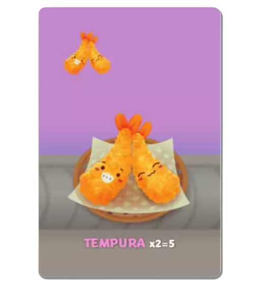 |
| Sashimi | 14 | 🐟 | 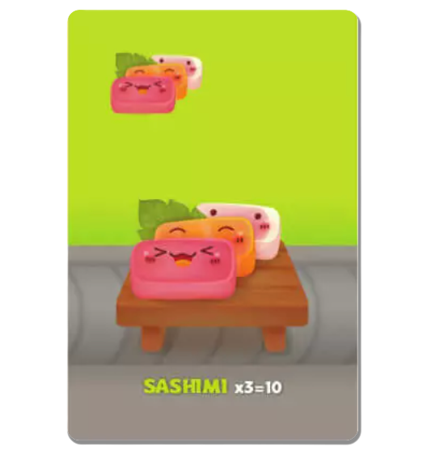 |
| Dumpling | 14 | 🥟 | 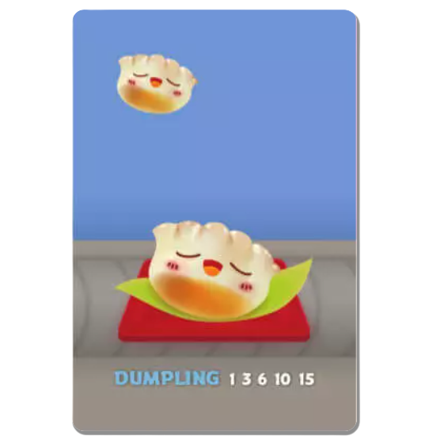 |
| Maki (1 symbol) | 6 | 🍙 | 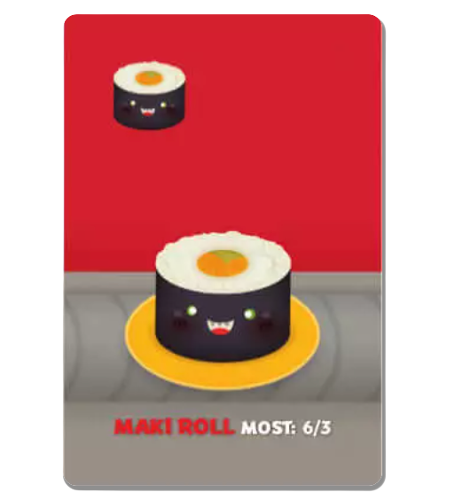 |
| Maki (2 symbols) | 12 | 🍙🍙 | 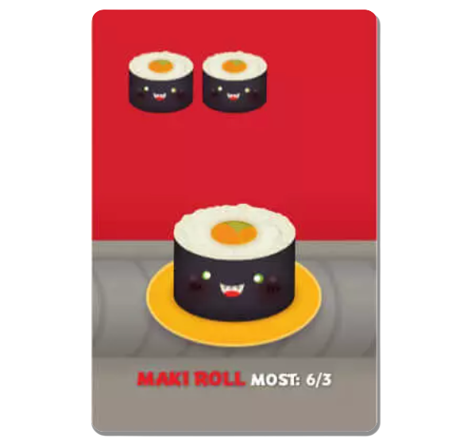 |
| Maki (3 symbols) | 8 | 🍙🍙🍙 | 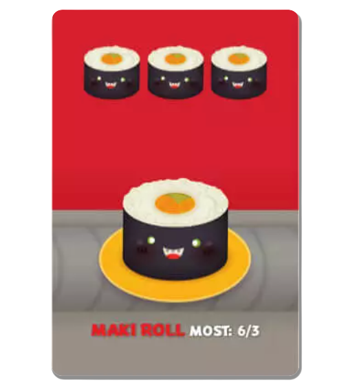 |
| Salmon Sushi | 10 | 🍣 | 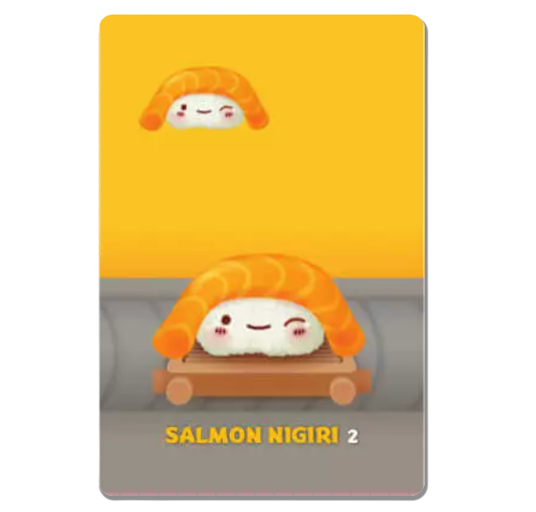 |
| Squid Sushi | 5 | 🦑🍣 | 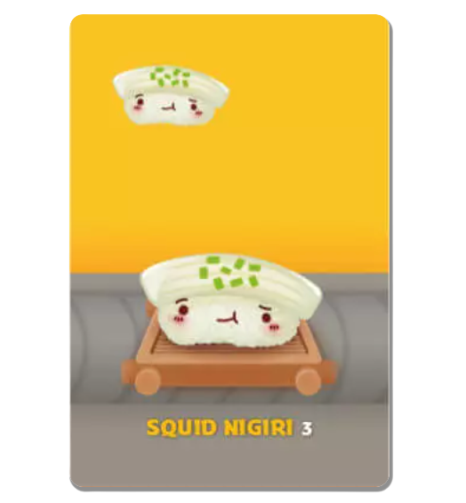 |
| Egg Sushi | 5 | 🍳🍣 | 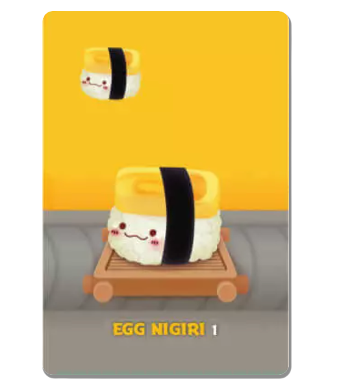 |
| Pudding | 10 | 🍰 |  |
| Wasabi | 6 | 🌿 | 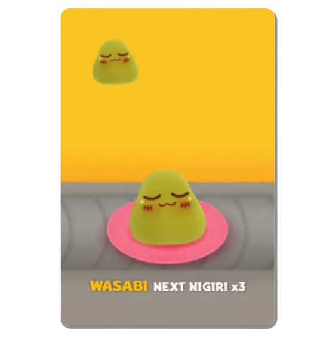 |
| Chopsticks | 4 | 🥢 | 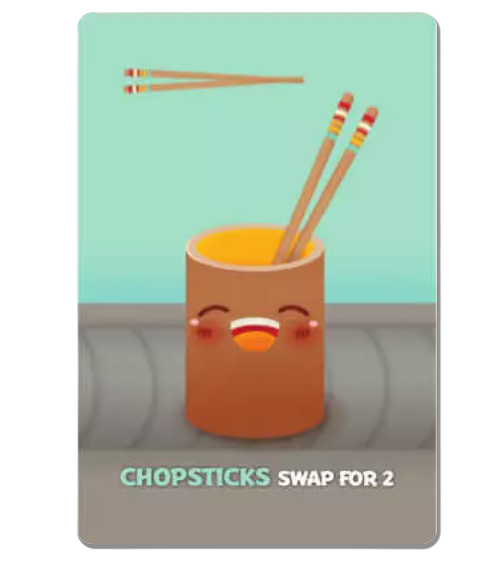 |

---

## Scoring Rules

### Maki 
Each maki cards can have 1, 2, or 3 maki symbols on the card. Players can pick multiple maki cards to combine the number of maki. 
At the end of each rounds, all the players compare their total number of maki symbols:
- **Player with most symbols:** 6 points
- **Second player with most symbols:** 3 points
- Ties split points between players

*Example: Player A has combined 5 symbols, Player B has 3, Player C has 3*
- A gets 6 points (most symbols)
- B and C split second place: 1 point each (3÷2)

### Tempura 
Tempura cards have to be collected in pairs at the end of the round in order to give points
- **2 cards = 5 points**
- 1 card = 0 points
- 3 cards = 5 points (1 tempura alone = 0 points)
- 4 cards = 10 points

### Sashimi 
Sashimi cards have to be collected in triplet at the end of the round in order to give points
- **3 cards = 10 points**
- 1 or 2 cards = 0 points
- 6 cards = 20 points, etc.

### Dumpling 
Dumpling cards allow a progressive scoring, the more cards you collect, the more points it will give
| # of Dumpling cards | Points given |
|---------------------|--------------|
| 1 | 1 |
| 2 | 3 |
| 3 | 6 |
| 4 | 10 |
| 5+ | 15 |

### Sushi 
It exists 3 types of sushi cards:
- **Egg Sushi:** 1 point
- **Salmon Sushi:** 2 points
- **Squid Sushi:** 3 points

### Wasabi 
The wasabi card triples the value of your next sushi card. You have to first pick a wasabi, and later in the round combine it with any sushi card (egg, salmon, or squid) to apply its effect, the sushi is now worth 3 times its point base value.
**Values with Wasabi:**
- Egg: 1 → **3 points**
- Salmon: 2 → **6 points**
- Squid: 3 → **9 points**

**Notes:**
- Wasabi cards always have to be played before the next sushi to apply its effect
- You can have multiple Wasabi cards waiting for next several sushis
- Each Wasabi can only hold one Sushi
- An unused Wasabi at round end = 0 points

### Pudding 
Pudding cards are special cards that you can pick at any round when you have one in hand, but once played it will be stored in a separate category that will not reset at the end of each round. It means that players can combine several pudding cards over the 3 rounds. The points of the pudding will be attributed ONLY at the end of round 3, for the final score. 
- **Player with most puddings:** +6 points
- **Player with fewest puddings:** -6 points
- Ties split points
- In 2-player games: no negative points for the player with the fewest pudding

### Chopsticks 
Chopstick cards allow players to pick 2 cards on a future turn. 
**How it works:**
1. Pick Chopsticks (they sit here in your played hand)
2. On a later turn, when selecting your card:
   - You can choose a first card as normal
   - If you have picked chopsticks before, you can decide to activate its ability and choose a second card from your hand
   - Chopsticks will be put back into the hand and passed to the next player

**Notes:**
- Chopsticks based point value is 0, it only allows to pick 2 cards in 1 turn
- You can have multiple Chopsticks
- You can only use one Chopsticks per turn

---

## How to Play

### Game Structure
1. Deck is shuffled and cards are dealt based on the number of player (between 7 and 10 cards per player)
2. Each player can take a look at their hand and select one card. 
3. All picked cards are revealed simultaneously, and placed in each player's played hand
4. Hands with the remaining cards are all passed to the next player
5. The process is repeated until all turns are played (between 7 and 10 turns based on the number of cards distributed)
6. At the end of the round, the points are calculated for each players, pudding are kept aside and a new round can start
7. New round, cards are dealt, and repeat until the 3 rounds are played
8. At the end of the game, after the 3 rounds, total score is computed, adding the score of the pudding cards
9. The player with the highest score out of the 3 rounds wins

---
## Playing a Game

### Creating a game for the host player

1. After setting up the local server, open `http://localhost:8000` in your browser
2. Under "Create New Game":
   - Enter your name
   - Click **Create Game**
3. You'll see a 6-character game code (for example, `ABC123`)

### Joining a game for the other players

1. Open `http://localhost:8000` (in another tab or device)
2. Under "Join Existing Game":
   - Enter the game code given by the host
   - Enter your name
   - Click **Join Game**
3. You have to wait for all players to join, only the host sees the **Start Game** button, and you need at least 2 players to start

### Play the game

1. **Click on a card** in your hand to select it (highlighted border)
2. To use chopsticks, select your first card, a prompt ask you if you want to select a second card, then click your second card.
2. Click **Confirm Selection**, your selection is locked, just wait for other players to play, and just play the game untill the end

---

## Tips & Strategy

1. **Watch what others play** - Track what cards are being taken
2. **Count the Maki** - Watch for other player's maki picks, know if you can win or should give up and focus on another strategy
3. **Sashimi is risky** - Need exactly 3 for any points
4. **Wasabi + Squid** - Best combo for 9 points
5. **Don't ignore Pudding** - The -6 penalty hurts
6. **Use Chopsticks wisely** - Grab two key cards before they get to the next player

---

## Now check the README.md to understand how to start the server and launch your first game. Enjoy!
